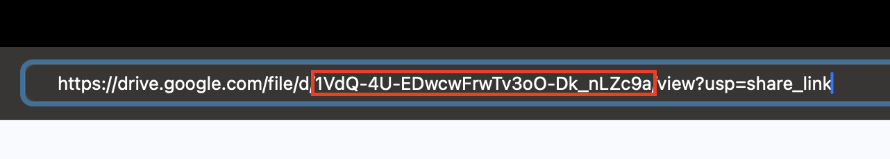

## Clone and Enter Repository in Greene
1. Enter scratch directory
    1. `cd $SCRATCH`
2. Clone
    1. `git clone https://github.com/NYU-robot-learning/min-stretch.git` 
3. Change directory
    1. `cd min-stretch`
4. Run setup script
    1. `./setup.sh`
5. Setup WandB
    1. TODO (ignore for now)

<!-- ## Setting up Mamba Environment

1. Download [mamba](https://mamba.readthedocs.io/en/latest/installation/mamba-installation.html#mamba-install) with instructions from [here](https://github.com/conda-forge/miniforge?tab=readme-ov-file#unix-like-platforms-mac-os--linux), also shown below
    1. Run the commands below in terminal and follow the instructions
        
        ```bash
        curl -L -O "https://github.com/conda-forge/miniforge/releases/latest/download/Miniforge3-$(uname)-$(uname -m).sh"
        bash Miniforge3-$(uname)-$(uname -m).sh
        ```
        
    2. Re-open shell and run `mamba activate` if not already in the base environment
2. Create environment
    1. `mamba env create -f conda_env.yaml` -->

## Request Resources and Set Up Environment on Greene
1. `cd $SCRATCH`
2. Request CPU resources in an interactive session
    1. `srun --nodes=1 --tasks-per-node=1 --cpus-per-task=16 --mem=64GB --time=2:00:00 --pty /bin/bash`
    2. This requests 16 CPUs, which is sufficient for data processing
3. Setup a Mamba environment
    1. `cp /vast/hre7290/overlay-home-robot-env.ext3 $SCRATCH`
    2. Enter singularity container: `singularity exec --overlay $SCRATCH/overlay-home-robot-env.ext3:ro /scratch/work/public/singularity/cuda11.8.86-cudnn8.7-devel-ubuntu22.04.2.sif /bin/bash`
    3. https://github.com/conda-forge/miniforge
    4. `mamba env create -f conda_env.yaml`

More detailed instructions for getting started on Greene: https://sites.google.com/nyu.edu/nyu-hpc/hpc-systems/greene/getting-started?authuser=0

Best practices on Greene: https://sites.google.com/nyu.edu/nyu-hpc/hpc-systems/greene/best-practices?authuser=0
## Data Processing
1.  Compress videos taken from the Record3D app. Separate each environment/scene into its own zip file.
    
2. Upload zip files to Google Drive and make them public.
3. Activate Conda/Mamba environment in Singularity container on Greene
    1. `mamba activate home_robot`
4. Modify required variables in `download_data.sh`.
   1. `GDRIVE_FILE_ID` 
   Share + "Get link" 
   2. `TASK_NUMBER`
   3. `NET_ID`
   4. `ENV_NO`
5. Run `./download_data.sh` in command line.
6. Repeat 3 and 4 for each .zip file. 
7. Run `./process_data.sh` in command line.

## Model Training
1. Split data into train and validation
    1. `./split_data.sh`
    2. Only do this **once**
2. Test whether code runs on CPU before submitting a GPU job
    1. Test RVQ training
        1. Set "include_task" in `test_rvq_cpu.sh`
        2. Run `./test_rvq_cpu.sh`
        3. Quit program (ctrl+c) once first epoch begins
    2. Test VQ-BeT training
        1. Set "include_task" in `test_vqbet_cpu.sh`
        2. Run `./test_vqbet_cpu.sh`
        3. Quit program (ctrl+c) once first epoch begins
3. If 2. is complete without errors, set "include_task" in `train_vqbet_model.sh`
4. Submit GPU training job
    1. `sbatch train_vqbet.slurm`

<!-- ## Robot Deployment
1.  -->

<!-- # Setting Up & Running Zero-Shot Models on Hello Robot Stretch

1. Ensure you have red cylindrical gripper tips on your Stretch’s end-effector
2. Clone and enter repository
    1. `git clone https://github.com/haritheja-e/robot-utility-models.git` 
    2. `cd robot-utility-models`

Open 2 terminal windows. On one side follow “Robot Server” instructions and on the other side follow “Imitation in Homes” instructions below. 

## Robot Server

This is run in the Hello Robot’s root pip environment (outside conda/mamba)

1. Enter the `robot-server` folder
    1. `cd robot-server`
2. Install required packages
    1. `pip install -r requirements.txt`
3. Start server
    1. If using the SE3’s default D405 wrist camera:
        1. `python3 start_server.py camera=d405` 
    2. If using an iPhone Pro (Record3D app’s USB Streaming)
        1. Ensure the phone’s angle relative to gripper is 75º using a third-party app (we use “Precise Level” app)
        2. `python3 start_server.py camera=iphone`

## Imitation in Homes

1. Download [mamba](https://mamba.readthedocs.io/en/latest/installation/mamba-installation.html#mamba-install) with instructions from [here](https://github.com/conda-forge/miniforge?tab=readme-ov-file#unix-like-platforms-mac-os--linux), also shown below
    1. Run the commands below in terminal and follow the instructions
        
        ```bash
        curl -L -O "https://github.com/conda-forge/miniforge/releases/latest/download/Miniforge3-$(uname)-$(uname -m).sh"
        bash Miniforge3-$(uname)-$(uname -m).sh
        ```
        
    2. Re-open shell and run `mamba activate` if not already in the base environment
2. Enter the `imitation-in-homes` folder
    1. `cd imitation-in-homes` 
3. Create environment
    1. `mamba env create -f conda_env.yaml`
4. Edit `configs/env_vars/env_vars.yaml`
    1. Set `project_root` variable to your imitation-in-homes directory
5. Load and run the desired policy (VQ-BeT): 
    1. `python run.py task=door_opening`
    2. `python run.py task=drawer_opening` 
    3. `python run.py task=reorientation`
    4. `python run.py task=bag_pick_up` 
    5. `python run.py task=tissue_pick_up`
6. Ensure the device you’re SSH-ing from and the robot are on the same network
7. Open the UI in your local browser at `http://ROBOT_IP:7860` 
8. Follow the instructions in the UI to run the policy. See the video below for a quick example of using the UI: 
    
    [ui_example.mov](Setting%20Up%20&%20Running%20Zero-Shot%20Models%20on%20Hello%20Rob%2066658ab1a6454f219e0fb1db1baa9d6f/ui_example.mov)
    
9. Optionally: run Diffusion Policy by
    1. `python run.py --config-name=run_diffusion task=door_opening`
    2. `python run.py --config-name=run_diffusion task=drawer_opening` 
    3. `python run.py --config-name=run_diffusion task=reorientation`
    4. `python run.py --config-name=run_diffusion task=bag_pick_up` 
    5. `python run.py --config-name=run_diffusion task=tissue_pick_up`
    6. Note: Diffusion Policy will run very slow on the robot’s CPU (upwards of 5 seconds per step). Modify the following to run on a GPU workstation: 
        1. Ensure the robot and GPU workstation are on the same network
        2. In `robot-server/configs/network/network.yaml` on your robot, set
            1. `host_address` to your robot’s IP
            2. `remote_address` to your workstation’s IP
            3. Then run `python3 start_server.py`
        3. We now instead run `run.py` on the workstation. In `imitation-in-homes/configs/run_diffusion.yaml` on your workstation set
            1. `network.host` to your workstation’s IP
            2. `network.remote` to your robot’s IP 
            3. Then run the desired `python run.py` command -->